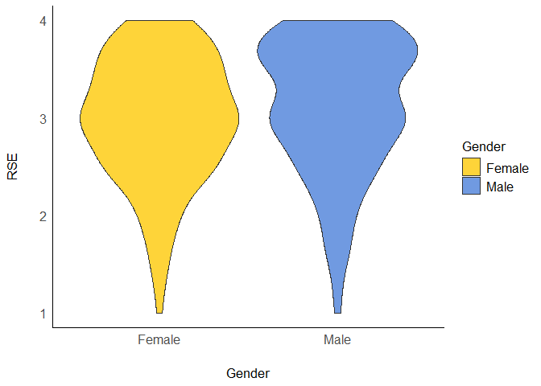
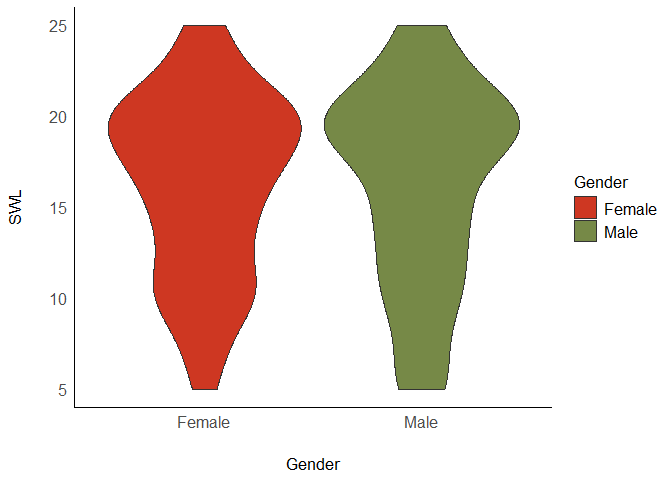

Lab3
================
Sidney Spilfogel
2024-09-19

# Load Packages

``` r
library(haven)
library(dplyr)
```

    ## 
    ## Attaching package: 'dplyr'

    ## The following objects are masked from 'package:stats':
    ## 
    ##     filter, lag

    ## The following objects are masked from 'package:base':
    ## 
    ##     intersect, setdiff, setequal, union

``` r
library(tidyr)
library(ggplot2)
library(psych)
```

    ## 
    ## Attaching package: 'psych'

    ## The following objects are masked from 'package:ggplot2':
    ## 
    ##     %+%, alpha

``` r
library(bruceR)
```

    ## 
    ## bruceR (v2024.6)
    ## Broadly Useful Convenient and Efficient R functions
    ## 
    ## Packages also loaded:
    ## ✔ data.table ✔ emmeans
    ## ✔ dplyr      ✔ lmerTest
    ## ✔ tidyr      ✔ effectsize
    ## ✔ stringr    ✔ performance
    ## ✔ ggplot2    ✔ interactions
    ## 
    ## Main functions of `bruceR`:
    ## cc()             Describe()  TTEST()
    ## add()            Freq()      MANOVA()
    ## .mean()          Corr()      EMMEANS()
    ## set.wd()         Alpha()     PROCESS()
    ## import()         EFA()       model_summary()
    ## print_table()    CFA()       lavaan_summary()
    ## 
    ## For full functionality, please install all dependencies:
    ## install.packages("bruceR", dep=TRUE)
    ## 
    ## Online documentation:
    ## https://psychbruce.github.io/bruceR
    ## 
    ## To use this package in publications, please cite:
    ## Bao, H.-W.-S. (2024). bruceR: Broadly useful convenient and efficient R functions (Version 2024.6) [Computer software]. https://CRAN.R-project.org/package=bruceR

    ## 
    ## These packages are dependencies of `bruceR` but not installed:
    ## - pacman, openxlsx, ggtext, lmtest, vars, phia, MuMIn, GGally
    ## 
    ## ***** Install all dependencies *****
    ## install.packages("bruceR", dep=TRUE)

``` r
library(ggsci)
library(see)
```

    ## 
    ## Attaching package: 'see'

    ## The following objects are masked from 'package:ggsci':
    ## 
    ##     scale_color_material, scale_colour_material, scale_fill_material

# Load Datasets

``` r
lab3data <- read.csv("C:/Users/sidne/OneDrive/Documents/GitHub/Lab3/lab3data.csv") #how to read csv file into R - go to file - properties - file location - paste into line of code with /file_name.csv make sure to use / not \
```

# Missing Data

``` r
#Listwise deletion
list_lab3data<- drop_na(lab3data) #drop_na removes any rows that has missind data in any columns makes a new data set with missing data removed

#pair wise deletion will only be used when you run the actual analysis using "na.rm = TRUE"
```

# Recode Variables: Changing Numeric Values to Characters

``` r
lab3data %>% count(Gender) #changing 1/2 into male/female
```

    ##   Gender   n
    ## 1      1 154
    ## 2      2 145
    ## 3     NA   1

``` r
#Solution 1
lab3data<- lab3data%>%
  mutate_at(c('Gender'),funs(str_replace(., "1", "Male")))
```

    ## Warning: `funs()` was deprecated in dplyr 0.8.0.
    ## ℹ Please use a list of either functions or lambdas:
    ## 
    ## # Simple named list: list(mean = mean, median = median)
    ## 
    ## # Auto named with `tibble::lst()`: tibble::lst(mean, median)
    ## 
    ## # Using lambdas list(~ mean(., trim = .2), ~ median(., na.rm = TRUE))
    ## Call `lifecycle::last_lifecycle_warnings()` to see where this warning was
    ## generated.

``` r
lab3data<- lab3data%>%
  mutate_at(c('Gender'),funs(str_replace(., "2", "Female")))
```

    ## Warning: `funs()` was deprecated in dplyr 0.8.0.
    ## ℹ Please use a list of either functions or lambdas:
    ## 
    ## # Simple named list: list(mean = mean, median = median)
    ## 
    ## # Auto named with `tibble::lst()`: tibble::lst(mean, median)
    ## 
    ## # Using lambdas list(~ mean(., trim = .2), ~ median(., na.rm = TRUE))
    ## Call `lifecycle::last_lifecycle_warnings()` to see where this warning was
    ## generated.

``` r
#Solution 2

#lab3data$Gender<-recode(lab3data$Gender, '1' = 'X', '2' = 'Y')
```

# Recode Variables: Changing Numeric Values to Different Numeric Values

``` r
lab3data %>% count(RSE2) # tells you the range of the item ex 1-4 and how many ppl chose each value
```

    ##   RSE2   n
    ## 1    1 124
    ## 2    2  86
    ## 3    3  53
    ## 4    4  37

``` r
lab3data$RSE2_R <- 5 - lab3data$RSE2 # to recode do scale max +1 - value to give reverse coded items

#check to see if the recoding was successful
lab3data %>% count(RSE2_R) # showing new distribution so see how values switched 
```

    ##   RSE2_R   n
    ## 1      1  37
    ## 2      2  53
    ## 3      3  86
    ## 4      4 124

``` r
#Now do the same for the other items (5,6,8,9)
#column 5
lab3data %>% count(RSE5) 
```

    ##   RSE5   n
    ## 1    1 117
    ## 2    2 108
    ## 3    3  49
    ## 4    4  26

``` r
lab3data$RSE5_R <- 5 - lab3data$RSE5
#column 6
lab3data %>% count(RSE6) 
```

    ##   RSE6   n
    ## 1    1 112
    ## 2    2  86
    ## 3    3  66
    ## 4    4  36

``` r
lab3data$RSE6_R <- 5 - lab3data$RSE6
#column 8
lab3data %>% count(RSE8) 
```

    ##   RSE8  n
    ## 1    1 76
    ## 2    2 94
    ## 3    3 82
    ## 4    4 48

``` r
lab3data$RSE8_R <- 5 - lab3data$RSE8
#column 9
lab3data %>% count(RSE9) 
```

    ##   RSE9   n
    ## 1    1 143
    ## 2    2  90
    ## 3    3  38
    ## 4    4  29

``` r
lab3data$RSE9_R <- 5 - lab3data$RSE9
```

# Create Composites

``` r
#Depending on the scale, sometimes you need to average across the items, other times you might need to sum 


#Fill in the items
lab3data <- lab3data %>% #Adding an new row into original data set lab3data, if want to write a new data set change the name
  mutate(RSE = rowMeans(cbind(RSE1, RSE2_R, RSE3, RSE4,RSE5_R,RSE6_R,RSE7,RSE8_R,RSE9_R, RSE10))) #get the sum score for each row make sure to put REVERSE CODED ITEMS 

#Create another composite for SWL, but this time use rowSums

lab3data <- lab3data %>%
  mutate(SWL=rowSums(cbind(SWL1,SWL2,SWL3,SWL4,SWL5)))
```

# Get Summary Descriptive Statistics

``` r
lab3data %>% 
  group_by(Gender) %>%
  dplyr::summarize(mean_RSE    = mean(RSE), 
      mean_SWL    = mean(SWL),
      std_dev_RSE = sd(RSE), 
      std_dev_SWL = sd(SWL),
      corr_RSE_SWL  = cor(RSE, SWL)
    )
```

    ## # A tibble: 3 × 6
    ##   Gender mean_RSE mean_SWL std_dev_RSE std_dev_SWL corr_RSE_SWL
    ##   <chr>     <dbl>    <dbl>       <dbl>       <dbl>        <dbl>
    ## 1 Female     2.98     16.3       0.641        4.97        0.356
    ## 2 Male       3.12     16.2       0.683        5.48        0.496
    ## 3 <NA>       2.6      16        NA           NA          NA

# Q1: Descrptively, which group has a higher self-esteem? What about life satisfaction? Is the relationship between self-esteem and life satisfaction stronger for males or for females?

Men have a higher self esteem, Women have a higher life satisfaction.
The relationship between RSE and SWL is stronger for men than women

# Visualization of Data Distribution

``` r
lab3data<- lab3data %>%
  drop_na(Gender) # removing missing data 


ggplot(lab3data, aes(x = Gender, y = RSE)) + geom_violin(aes(fill=Gender)) + scale_fill_simpsons() + theme_modern()
```

<!-- -->

``` r
#Create a plot for SWL by Gender with a different color palette
lab3data<- lab3data %>%
  drop_na(Gender) # removing missing data 


ggplot(lab3data, aes(x = Gender, y = SWL)) + geom_violin(aes(fill=Gender)) + scale_fill_pizza() + theme_modern()
```

<!-- -->

``` r
?scale_fill_simpsons #opens in viewer for color scale details
```

    ## starting httpd help server ... done

# Q2: What you can tell from looking at a violin plot? What you cannot tell? What inferences you can make based on the two violin plots?

The violin plot tells you the distribution of the data.By looking at the
wider parts of the chart you can see the scores that are a higher
density versus a lower one where it is thinner. It tells you the central
tendency and how the scores are spread.

It doesn’t tell you individual data points, mean, or showing outliers.

Based on the RSE plot you can see that more men score higher on the
measure than woman by the thick portion on the top. Meaning that men
score higher in general than women. The SWL plot shows a more similar
distribution among men and women because they have a similar shape, this
shows that the means are similar between men and women.
